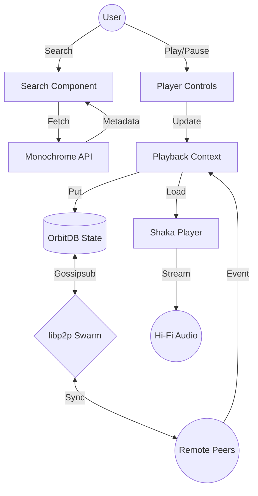

# Bloom Architecture Document

## Overview
Bloom is a decentralized, peer-to-peer (P2P) music streaming application that allows users to create rooms, search for high-fidelity music, and listen in sync with others. It operates without a central server for room coordination or data storage.

## Technical Stack
| Layer | Technology |
| :--- | :--- |
| **UI Framework** | [React 18](https://reactjs.org/) |
| **Build Tool** | [Vite 6](https://vitejs.dev/) |
| **Styling** | [Tailwind CSS](https://tailwindcss.com/) |
| **P2P Database** | [OrbitDB v4 (@orbitdb/core)](https://orbitdb.org/) |
| **IPFS Node** | [Helia v7](https://helia.io/) |
| **Networking** | [libp2p v1](https://libp2p.io/) (WebRTC, WebSockets) |
| **Media Player** | [Shaka Player](https://shaka-player-demo.appspot.com/) |
| **Music Source** | [Monochrome API](https://api.monochrome.tf/) (Tidal-powered) |

## System Architecture

### 1. Decentralized Networking (libp2p)
Each Bloom client acts as a full node in the IPFS network.
- **Transports**: Uses **WebRTC** for direct browser-to-browser connections and **WebSockets** for bootstrap nodes.
- **Relay (Circuit Relay V2)**: Critical for "online" usage. Since browsers cannot be dialed directly, they use Relay nodes to coordinate connections across different networks.
- **Discovery**: Uses **Gossipsub** (PubSub) for real-time state broadcasting and discovery within a room.

### 2. Distributed Database (OrbitDB)
Bloom uses OrbitDB to replicate state across all participants in a room.
- **KeyValue Database**: Synchronizes the player state (current track, play/pause, seek time, queue).
- **EventLog Database**: Manages the room's chat history and GIF stickers.
- **Replication**: When a user changes the track, the update is broadcasted via Gossipsub. Other peers see the update and automatically fetch the new state from the swarm.

### 3. High-Fidelity Media Playback
Powered by **Shaka Player**, Bloom streams high-quality Tidal content.
- **Resilient Manifests**: Attempts to load modern DASH manifests first, with a robust fallback to legacy Tidal streaming endpoints if necessary.
- **Adaptive Bitrate**: Automatically switches between Hi-Res (24-bit FLAC) and compressed formats based on connection speed.

## Data Flow Diagram

## Persistence & Identity
- **Storage**: Uses **IndexedDB** (`blockstore-idb`) to persist the IPFS node's PeerID and database data across browser refreshes.
- **Identities**: Cryptographic keys are generated per user, ensuring that "Owner" permissions for a room are maintained across sessions.

## Online Connectivity (Production Best Practices)
To ensure Bloom works over the open internet:
- **Bootstrap Nodes**: Connects to Protocol Labs bootstrap peers to join the global IPFS DHT.
- **Relay Reservations**: The app automatically makes a reservation on a public relay, allowing other peers to find it even if it lacks a public IP address.
