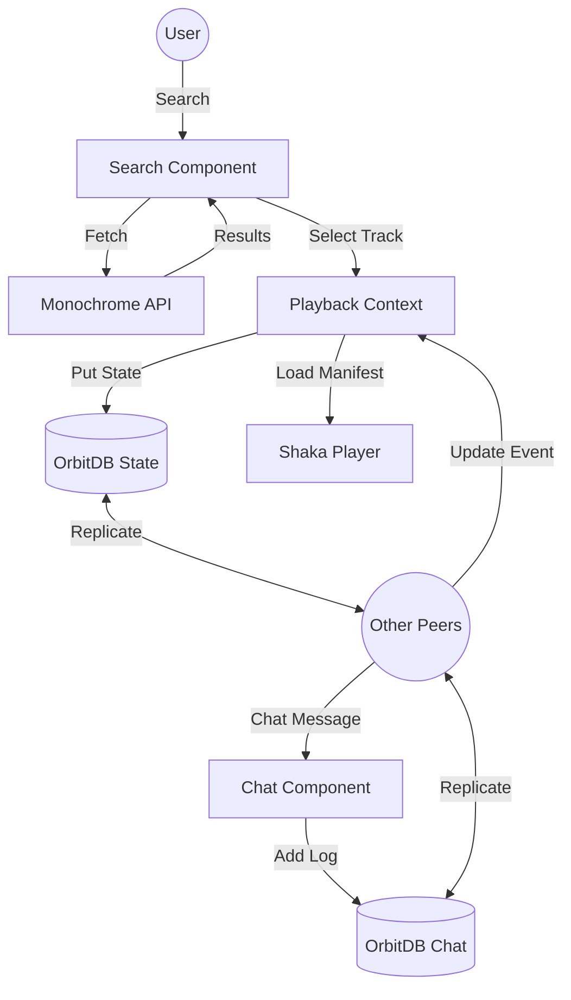

# Bloom Architecture Document

This document provides a comprehensive overview of the Bloom application architecture, designed for peer-to-peer synchronized high-fidelity music discovery and playback.

## Tech Stack Overview

- **Frontend Framework**: [React 18](https://react.dev/) with functional components and Hooks.
- **Build Tool**: [Vite 6](https://vitejs.dev/) for high-performance bundling and HMR.
- **Styling**: [Tailwind CSS](https://tailwindcss.com/) with a custom "Pitch Black" theme.
- **P2P Layer**: [OrbitDB v4 (Core)](https://orbitdb.org/) powered by [Helia](https://helia.io/) (modern IPFS).
- **Networking**: [libp2p](https://libp2p.io/) with browser-compatible transports (WebRTC, WebSockets).
- **Media Playback**: [Shaka Player](https://shaka-player-demo.appspot.com/) for robust DASH/HLS streaming and adaptive quality.
- **Data Source**: [Monochrome API](https://api.monochrome.tf/) (Tidal-powered) for search, metadata, and manifests.

---

## Component Architecture

### 1. Context Providers (The Core)
- **`OrbitContext`**: Manages the lifecycle of the Helia node and OrbitDB instances. It handles cryptographic identities and opens the room-specific databases.
- **`PlaybackContext`**: Wraps Shaka Player. It manages the queue, current track, and playback state, synchronizing local actions with OrbitDB updates.

### 2. P2P Synchronization Logic
Bloom uses two types of decentralized databases per room:
- **`KeyValue` Database (`roomId-state`)**: Synchronizes the shared room state.
    - `currentTrack`: The metadata of the song being played.
    - `isPlaying`: Boolean flag for play/pause state.
    - `currentTime`: Playback position for sync-seek.
    - `queue`: The shared playlist of tracks.
    - `members`: List of active peers and their roles (Owner, Admin, Member).
- **`EventLog` Database (`roomId-chat`)**: An append-only log for real-time chat messages and GIF stickers.

### 3. Media Handling & Resilience
The `PlaybackProvider` implements a resilient manifest fetching strategy:
1. **Primary**: Tries to fetch a modern DASH manifest from `/trackManifests/${id}`.
2. **Fallback**: If the primary fails (404), it falls back to the `/track/` endpoint, decodes the base64 manifest, and extracts the direct streaming URL.
3. **Adaptive Bitrate (ABR)**: Uses Shaka Player's internal engine to switch between `FLAC_HIRES`, `FLAC`, and `AAC` based on network conditions when "Auto" is selected.

---

## Data Flow Diagram

---

## Implementation Details

### Security & Identity
- **Identities**: Uses OrbitDB's `Identities` module to generate persistent cryptographic keys stored in IndexedDB.
- **Access Control**: Currently open (anyone in the room can write), with plans to implement role-based access control (RBAC) via database manifest entries.

### Storage Persistence
- **Blockstore/Datastore**: In browsers, Helia uses `blockstore-idb` and `datastore-idb` for persistent storage, ensuring that PeerIDs and database data survive page reloads.
- **Memory Fallback**: A memory-based storage fallback is implemented for environments where IndexedDB is restricted.

### GIF Service
- **Tenor Integration**: Real-time GIF sticker search using the Tenor v1 API. Messages are sent as database events containing the GIF URL and metadata.

---

## Future Extensibility
- **Room Discovery**: Transition from manual Room IDs to a global DHT-based discovery service.
- **Offline First**: Enhanced caching of blocks to allow "offline" queue management that syncs when reconnected.
- **DRM Integration**: Full implementation of Widevine license requests via the API proxy.
