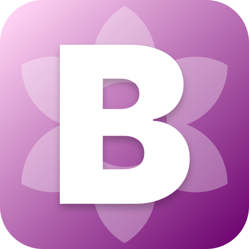

# Bloom

**A decentralized, P2P-synchronized music player for listening together.**

No accounts. No servers. No limits.

---

## What is Bloom?

Bloom lets you and your friends listen to the same song at the exact same moment — without any central server coordinating you. Create a room, share the invite link, press play. Everyone hears it together.

When everyone leaves, the room vanishes. No history, no data stored, no trace.

---

## Features

- 🎵 **Synchronized playback** — everyone in the room hears the same thing, in real time
- 💬 **Room chat** — text, GIFs, and song recommendations, all synced peer-to-peer
- 🗳️ **Voting system** — anyone can suggest a song; host can approve or let the room vote it in
- 🎤 **Live lyrics** — time-synced lyrics that follow along as the track plays
- 📊 **Music visualizer** — real-time spectrum analyzer that pulses to the beat
- 🎨 **Dynamic theming** — the UI color palette shifts with every album art
- 👑 **Role system** — host and admins control playback; peers listen and suggest
- 📋 **Collaborative queue** — import playlists or build the queue together

---

## How rooms work

Every room has a **Host** who controls playback — play, pause, skip, and manage the queue. The host can promote others to **Admin**, giving them the same controls.

**Song recommendations & voting:**

| What happens | Result |
|---|---|
| Host or admin votes Agree | Song is immediately added |
| Host or admin votes Disagree | Song is rejected |
| Host/admin doesn't vote | Auto-added once 50%+ of the room agrees |

A live progress bar on each card shows exactly how many votes are needed.

---

## Running locally

Requires [Node.js](https://nodejs.org) v20+. Clone the repo from here:

**[github.com/TheGandabherunda/bloom](https://github.com/TheGandabherunda/bloom)**

---

## Legal

Bloom is an educational, open-source project for personal, non-commercial use only. It does not host, store, or own any music, lyrics, or album art — all content is sourced in real-time from publicly available third-party services. All rights belong to their respective artists and copyright holders.

By using this software, you are solely responsible for complying with copyright laws in your region.

---

  Made for the love of music and good company.

